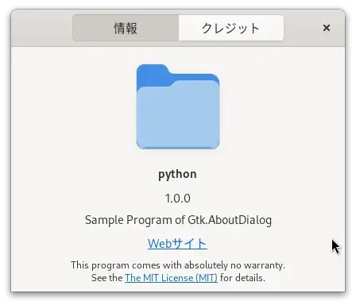

# pyt_gtk4_aboutdialog

<br>

## 内容 

Gtk.HeaderBarに設置したボタンを押して表示されるPopover上のボタンを押した場合に、Gtk.AboutDialogを表示するプログラムです。

  

<br>

Gtk.AboutDialogの表示・非表示は、set_visible()で指定します。  
Gtk.AboutDialogの非表示は、Closeボタンを押した時におこなうのでシグナル'close_request'と紐付けた関数で行っており、Trueを返すことで他のハンドラを呼び出すのを防ぐことでGtk.AboutDialogが破壊されるのを防いでいます。この指定をおこなわないと、再度Gtk.AboutDialogを表示しようとした場合、Gtk-WARNINGが発生します。

[close_request](https://lazka.github.io/pgi-docs/Gtk-4.0/classes/Window.html#Gtk.Window.signals.close_request)

```
    def on_about_clicked(self, action, param):
        self.aboutdialog.set_visible(True)

    @Gtk.Template.Callback()
    def on_dialog_closereq(self, dialog):
        dialog.set_visible(False)
        return True
```

<br>

## 履歴

2024/6/8 プログラム作成  

<br>

## 参考にしたHP
